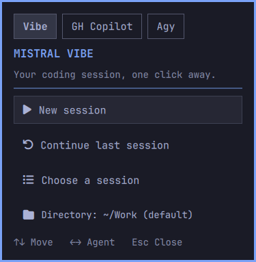

# Vibe Launcher for Omarchy

A bar widget for [Mistral Vibe](https://github.com/mistralai/mistral-vibe),
[GitHub Copilot](https://github.com/github/copilot-cli), and
[Antigravity](https://github.com/google-antigravity/antigravity-cli) on
Omarchy Quattro. Click **Vibe** to open a small, keyboard-friendly panel:



- **Agent picker** switches between Mistral Vibe, GitHub Copilot, and
  Antigravity with Left/Right or by clicking the chips at the top.
- **New session** starts an interactive session for the chosen agent.
- **Continue last session** runs `<agent> --continue`.
- **Choose a session** opens the `--resume` picker for Vibe and Copilot;
  Antigravity picks sessions with `/resume` inside a running session, so the
  row is disabled for it.
- **Directory** sets where sessions start.

Move with Up/Down, launch with Enter, Left/Right switches the agent, Esc
closes. Sessions start in `~/Work` if it exists, otherwise in your home
directory.

## Working directory

Press `D` (or click the directory row) to open the directory box:

- Type a path — `~/Projects` or an absolute path — and press `Enter` to
  save it.
- `Tab` completes the path segment like a shell: a unique match completes
  fully, several matches extend to their common prefix, and matching is
  case-insensitive. Hidden folders are never offered.
- **Reset to default** restores the `~/Work`-or-home default.

The choice is saved to the widget's `workDirectory` setting and persists
across bar reloads and reboots. It can also be set from the CLI (quote `~`
so your shell does not expand it):

```sh
omarchy bar set keis.vibe workDirectory '~/Projects/My Project'
```

Set it back to `~/Work` or an empty string to restore the default behavior.
A configured directory must exist and be accessible; otherwise the panel
shows an error instead of launching.

## Summon from a keybinding

The widget registers the IPC target `keis.vibe`:

```sh
qs -p /usr/share/omarchy/shell ipc call keis.vibe toggle
```

`pick` jumps straight to the directory box, and `state` prints the panel's
current state as JSON. Bind the command in `~/.config/hypr/bindings.lua`.

## Install

Requires Omarchy Quattro with the Quickshell plugin system, and Mistral
Vibe on your `PATH` — install it with the
[official instructions](https://github.com/mistralai/mistral-vibe#one-line-install-recommended)
or `uv tool install mistral-vibe`. Vibe handles its own account setup and
approval prompts; this widget only launches it. To launch Copilot or
Antigravity sessions, the
[Copilot CLI](https://github.com/github/copilot-cli/releases) or
[Agy CLI](https://github.com/google-antigravity/antigravity-cli) must also
be on your `PATH`; Vibe works without them.

From a public GitHub repository containing these files at its root:

```sh
omarchy plugin add https://github.com/anderskeis/keisVibe.git --enable
```

For a local copy under `~/.config/omarchy/plugins/keis.vibe/`:

```sh
omarchy-shell shell rescanPlugins
omarchy plugin enable keis.vibe --section right
```

If a QML edit does not appear after a rescan, run `omarchy restart shell`
to clear the shell's cached component.

## Upgrade

Installed plugins track this repository's default branch. Update with:

```sh
omarchy plugin update keis.vibe
```

What changed between versions is described on the
[releases page](https://github.com/anderskeis/keisVibe/releases).

## Validate and publish

```sh
omarchy plugin validate .
/usr/lib/qt6/bin/qmllint -I /usr/share/omarchy/shell BarWidget.qml Panel.qml
```

Publish these files at the repository root and submit its URL through the
[Omarchy Plugins](https://plugins.omarchy.org/publish.html) form. The
marketplace validates listings but does not sandbox plugins.

## Remove

```sh
omarchy plugin remove keis.vibe
```

This community plugin is not affiliated with Mistral or Omarchy.
